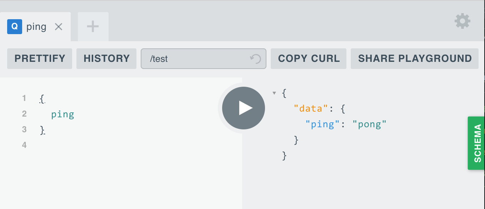

# Wwwision.GraphQL

Easily create GraphQL APIs with Neos and Flow.

## Background

This package is a small collection of tools that'll make it easier to provide [GraphQL](http://graphql.org/) endpoints
with Neos and Flow.
It is a wrapper for the [PHP port of webonyx](https://github.com/webonyx/graphql-php) that comes with following additions:

* A `TypeResolver` that allows for easy interdependency between complex GraphQL type definitions
* The `AccessibleObject` and `IterableAccessibleObject` wrappers that make it possible to expose arbitrary objects to
  the GraphQL API
* A `StandardController` that renders the [GraphQL Playground](https://github.com/prismagraphql/graphql-playground) and acts as dispatcher
  for API calls
* A HTTP Component that responds to `OPTIONS` requests correctly (required for CORS preflight requests for example)
* A custom `GraphQLContext` that is available in all resolvers and allows access to the current HTTP Request

## Installation

```
composer require wwwision/graphql
```

(Refer to the [composer documentation](https://getcomposer.org/doc/) for more details)

## Simple tutorial

Create a simple Root Query definition within any Flow package:

`ExampleRootQuery.php`:

```php
<?php
namespace Your\Package;

use GraphQL\Type\Definition\ObjectType;
use GraphQL\Type\Definition\Type;
use Wwwision\GraphQL\TypeResolver;

class ExampleRootQuery extends ObjectType
{
    /**
     * @param TypeResolver $typeResolver
     */
    public function __construct(TypeResolver $typeResolver)
    {
        parent::__construct([
            'name' => 'ExampleRootQuery',
            'fields' => [
                'ping' => [
                    'type' => Type::string(),
                    'resolve' => function () {
                        return 'pong';
                    },
                ],
            ],
        ]);
    }
}
```

Now register this endpoint like so:

`Settings.yaml`:

```yaml
Wwwision:
  GraphQL:
    endpoints:
      'test':
        'querySchema': 'Your\Package\ExampleRootQuery'
```

And, lastly, activate the corresponding routes:

`Settings.yaml`:

```yaml
Neos:
  Flow:
    mvc:
      routes:
        'Wwwision.GraphQL':
          variables:
            'endpoint': 'test'
```

This will make the endpoint "test" available under `/test`.

Note: If you already have more specific routes in place, or want to provide multiple GraphQL endpoints you can as well
activate routes in your global `Routes.yaml` file:

```yaml
-
  name: 'GraphQL API'
  uriPattern: '<GraphQLSubroutes>'
  subRoutes:
    'GraphQLSubroutes':
      package: 'Wwwision.GraphQL'
      variables:
        'endpoint': 'test'
```

**Congratulations**, your first GraphQL API is done and you should be able to invoke the GraphQL Playground by browsing to `/test`:



For a more advanced example, have a look at the [Neos Content Repository implementation](https://github.com/bwaidelich/Wwwision.Neos.GraphQL)

## Custom context

Resolvers should be as simple and self-contained as possible. But sometimes it's useful to have access to the current
HTTP request. For example in order to do explicit authentication or to render URLs.
With v2.1+ there's a new `GraphQLContext` accessible to all resolvers that allows to access the current HTTP request:

```php
<?php
// ...
use Wwwision\GraphQL\GraphQLContext;
// ...

        'resolve' => function ($value, array $args, GraphQLContext $context) {
            $baseUri = $context->getHttpRequest()->getBaseUri();
            // ...
        },
```

`$value` is the object containing the field. Its value is `null` on the root mutation/query.
`$args` is the array of arguments specified for that field. It's an empty array if no arguments have been specified.
`$context` is an instance of the `GraphQLContext` with a getter for the current HTTP request.

## Circular Dependencies

Sometimes GraphQL types reference themselves.
For example a type `Person` could have a field `friends` that is a list of `Person`-types itself.

The following code won't work with the latest version of this package:

```php
<?php
// ...

class Person extends ObjectType
{
    public function __construct(TypeResolver $typeResolver)
    {
        parent::__construct([
            'name' => 'Person',
            'fields' => [
                'name' => ['type' => Type::string()],
                'friends' => [
                    // THIS WON'T WORK!
                    'type' => Type::listOf($typeResolver->get(self::class)),
                    'resolve' => function () {
                        // ...
                    },
                ],
            ],
        ]);
    }
}
```
To solve this, the fields can be configured as closure like described in the [graphql-php documentation](https://webonyx.github.io/graphql-php/type-system/object-types/#recurring-and-circular-types):

```php
<?php
// ...

class Person extends ObjectType
{
    public function __construct(TypeResolver $typeResolver)
    {
        parent::__construct([
            'name' => 'Person',
            'fields' => function() use ($typeResolver) {
                return [
                    'name' => ['type' => Type::string()],
                    'friends' => [
                        'type' => Type::listOf($typeResolver->get(self::class)),
                        'resolve' => function () {
                            // ...
                        },
                    ],
                ];
            }
        ]);
    }
}
```

Alternatively the schema can be defined via a `*.graphql` file:

## Define Schemas using the GraphQL Schema language

Since version 3.0 schemas can be defined using the [GraphQL Schema language](https://graphql.org/learn/schema/).

Routes are configured like above, but in the endpoint settings instead of the `querySchema` the schema file and so called
`resolvers` are configured like so:

```yaml
Wwwision:
  GraphQL:
    endpoints:
      'test':
        schema: 'resource://Wwwision.Test/Private/GraphQL/schema.graphql'
        resolvers:
          'Query': 'Wwwision\Test\ExampleResolver'
```

The corresponding schema could look like:

```graphql
schema {
    query: Query
}

type Query {
    # some description
    ping(name: String!): String
}
```

And the resolver like:

```php
<?php
namespace Your\Package;

use Wwwision\GraphQL\AbstractResolver;

class ExampleResolver extends AbstractResolver
{

    public function ping($root = null, array $variables): string
    {
        return 'pong, ' . $variables['name'];
    }

}
```

## Security

In the GraphQL layer of your application you should not do domain specific i.e. critical operations.
Those should be encapsulated in corresponding services. Likewise the final protection (authentication, authorization)
should happen in those services.

Nevertheless the GraphQL Playground is not meant to be exposed to the public web. And maybe the 
GraphQL API should not be callable by unauthenticated requests, either.
The easiest way to protect those is a simple `Policy.yaml` like the following:

```yaml
privilegeTargets:

  'Neos\Flow\Security\Authorization\Privilege\Method\MethodPrivilege':
    'Wwwision.GraphQL:Playground.Blacklist':
      matcher: 'method(Wwwision\GraphQL\Controller\StandardController->indexAction())'
    'Wwwision.GraphQL:Api.Blacklist':
      matcher: 'method(Wwwision\GraphQL\Controller\StandardController->queryAction())'
    'Wwwision.GraphQL:Playground':
      matcher: 'method(Wwwision\GraphQL\Controller\StandardController->indexAction(endpoint == "{parameters.endpoint}"))'
      parameters:
        'endpoint':
          className: 'Neos\Flow\Security\Authorization\Privilege\Parameter\StringPrivilegeParameter'
    'Wwwision.GraphQL:Api':
      matcher: 'method(Wwwision\GraphQL\Controller\StandardController->queryAction(endpoint == "{parameters.endpoint}"))'
      parameters:
        'endpoint':
          className: 'Neos\Flow\Security\Authorization\Privilege\Parameter\StringPrivilegeParameter'
```

With the two blacklist privileges calls to the endpoints are forbidden by default (this is not required
if you use this package with Neos because that already blocks controller actions by default).
The other two privileges allow you to selectively grant access to a given endpoint like so:


```yaml
roles:
  'Neos.Flow:Everybody':
    privileges:
      -
        privilegeTarget: 'Wwwision.GraphQL:Api'
        parameters:
          'endpoint': 'test'
        permission: GRANT
```

This would re-enable the GraphQL API (POST requests) for any user, but keep the Playground blocked.
