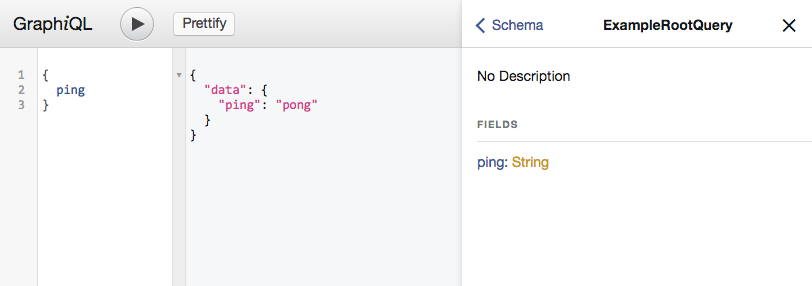

# Wwwision.GraphQL

Easily create GraphQL APIs with Neos and Flow.

## Background

This package is a small collection of tools that'll make it easier to provide [GraphQL](http://graphql.org/) endpoints
with Neos and Flow.
It is a wrapper for the [PHP port of webonyx](https://github.com/webonyx/graphql-php) that comes with following additions:

* A `TypeResolver` that allows for easy interdependency between complex GraphQL type definitions
* The `AccessibleObject` and `IterableAccessibleObject` wrappers that make it possible to expose arbitrary objects to
  the GraphQL API
* A `StandardController` that renders the [GraphiQL IDE](https://github.com/graphql/graphiql) and acts as dispatcher
  for API calls
* A HTTP Component that responds to `OPTIONS` requests correctly (required for CORS preflight requests for example)
* A custom `GraphQLContext` that is available in all resolvers and allows access to the current HTTP Request

## Installation

```
composer require wwwision/graphql
```

(Refer to the [composer documentation](https://getcomposer.org/doc/) for more details)

## Simple tutorial

Create a simple Root Query definition within any Flow package:

`ExampleRootQuery.php`:

```php
<?php
namespace Your\Package;

use GraphQL\Type\Definition\ObjectType;
use GraphQL\Type\Definition\Type;
use Wwwision\GraphQL\TypeResolver;

class ExampleRootQuery extends ObjectType
{
    /**
     * @param TypeResolver $typeResolver
     */
    public function __construct(TypeResolver $typeResolver)
    {
        return parent::__construct([
            'name' => 'ExampleRootQuery',
            'fields' => [
                'ping' => [
                    'type' => Type::string(),
                    'resolve' => function () {
                        return 'pong';
                    },
                ],
            ],
        ]);
    }
}
```

Now register this endpoint like so:

`Settings.yaml`:

```yaml
Wwwision:
  GraphQL:
    endpoints:
      'test':
        'querySchema': 'Your\Package\ExampleRootQuery'
```

And, lastly, activate the corresponding routes:

`Settings.yaml`:

```yaml
Neos:
  Flow:
    mvc:
      routes:
        'Wwwision.GraphQL':
          variables:
            'endpoint': 'test'
```

This will make the endpoint "test" available under `/test`.

Note: If you already have more specific routes in place, or want to provide multiple GraphQL endpoints you can as well
activate routes in your global `Routes.yaml` file:

```yaml
-
  name: 'GraphQL API'
  uriPattern: '<GraphQLSubroutes>'
  subRoutes:
    'GraphQLSubroutes':
      package: 'Wwwision.GraphQL'
      variables:
        'endpoint': 'test'
```

**Congratulations**, your first GraphQL API is done and you should be able to invoke the GraphiQL IDE by browsing to `/test`:



For a more advanced example, have a look at the [Neos Content Repository implementation](https://github.com/bwaidelich/Wwwision.Neos.GraphQL)

## Custom context

Resolvers should be as simple and self-contained as possible. But sometimes it's useful to have access to the current
HTTP request. For example in order to do explicit authentication or to render URLs.
With v2.1+ there's a new `GraphQLContext` accessible to all resolvers that allows to access the current HTTP request:

```php
<?php
// ...
use Wwwision\GraphQL\GraphQLContext;
// ...

        'resolve' => function ($value, array $args, GraphQLContext $context) {
            $baseUri = $context->getHttpRequest()->getBaseUri();
            // ...
        },
```

`$value` is the object containing the field. Its value is `null` on the root mutation/query.
`$args` is the array of arguments specified for that field. It's an empty array if no arguments have been specified.
`$context` is an instance of the `GraphQLContext` with a getter for the current HTTP request.